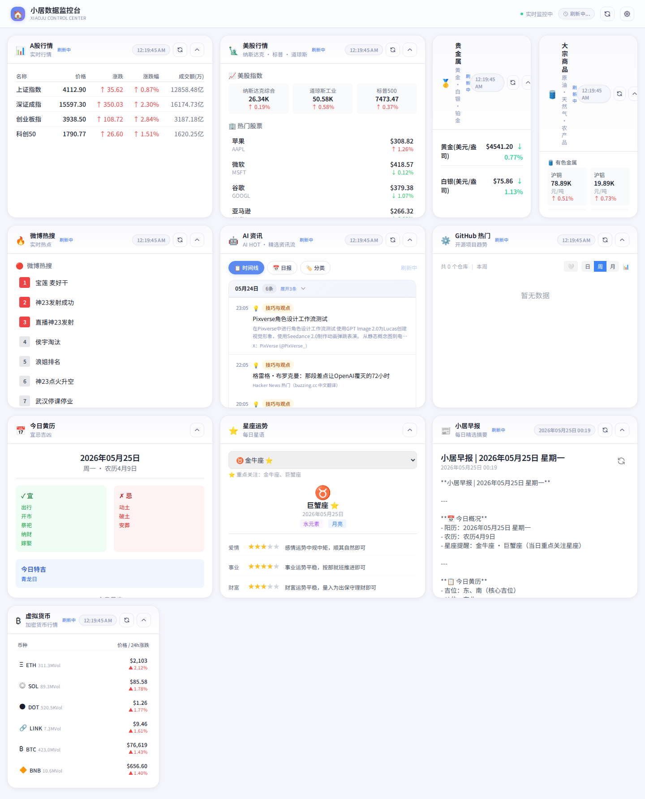
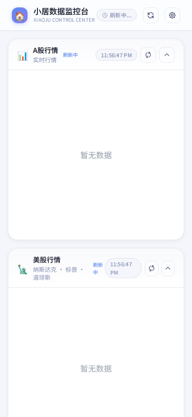

# 🏠 小居数据监控台

> 一个优雅的个性化数据监控仪表盘，聚焦 AI 资讯、A 股行情、微博热搜、数字货币等实时数据，支持飞书/企微早报推送。

## 📸 功能预览

**桌面端**


**移动端**


## ✨ 核心功能

| 模块 | 说明 |
|------|------|
| 🤖 **AI 资讯** | 精选 AI 行业动态，支持时间线 / 日报 / 分类三种视图 |
| 📊 **A股行情** | 沪深市场主要指数实时行情图表 |
| 🗽 **美股行情** | 纳斯达克、标普500、道琼斯实时数据 |
| 🥇 **贵金属** | 黄金、白银、铂金、钯金实时价格 |
| 🛢️ **大宗商品** | 原油、天然气、农产品期货行情 |
| 🔥 **微博热搜** | 实时微博热搜榜单 |
| ⚙️ **GitHub 热门** | 开源项目趋势，发现优质仓库 |
| ₿ **虚拟货币** | 主流加密货币行情监控 |
| 📅 **今日黄历** | 农历宜忌、节气提醒 |
| ⭐ **星座运势** | 每日星语与幸运指数 |
| 📰 **小居早报** | 每日自动生成 AI 精选早报 |
| 📬 **推送服务** | 飞书 / 企微 Webhook 定时推送 |

## 🛠️ 技术栈

**后端**
- FastAPI + Uvicorn
- httpx（异步 HTTP）
- APScheduler（定时任务）
- Python 3.12

**前端**
- React 18 + TypeScript
- Tailwind CSS（浅色高级感设计）
- Vite 构建
- React Grid Layout（响应式网格布局）

**部署**
- Docker Compose（前端 Nginx + 后端）
- systemd 服务守护

## 🚀 快速部署

```bash
# 1. 克隆项目
git clone https://github.com/q177010899a1a7-ship-it/xiaoju-dashboard.git
cd xiaoju-dashboard

# 2. 配置环境变量
cp .env.example .env
# 编辑 .env，填入飞书/企微 Webhook（可选）

# 3. 一键启动
docker-compose up -d
```

访问 `http://localhost:8080` 即可。

## 📁 项目结构

```
xiaoju-dashboard/
├── backend/
│   ├── routers/          # API 路由（新闻、AI资讯、股票、推送等）
│   ├── services/         # 缓存、定时任务、日志
│   └── main.py          # FastAPI 入口
├── frontend/
│   ├── src/components/  # React 组件
│   ├── src/hooks/       # 自定义 Hooks
│   └── dist/            # 构建产物
├── docs/                # 截图与文档
├── docker-compose.yml
└── README.md
```

## 🤖 AI 资讯数据来源

AI 资讯数据由 [AIHOT](https://aihot.virxact.com) 提供，无需 API Key，直接调用公开接口获取每日精选 AI 行业动态。

## 🌐 在线预览

部署后的服务地址（示例）：
```
http://YOUR_SERVER:8080
```

## 📝 License

MIT